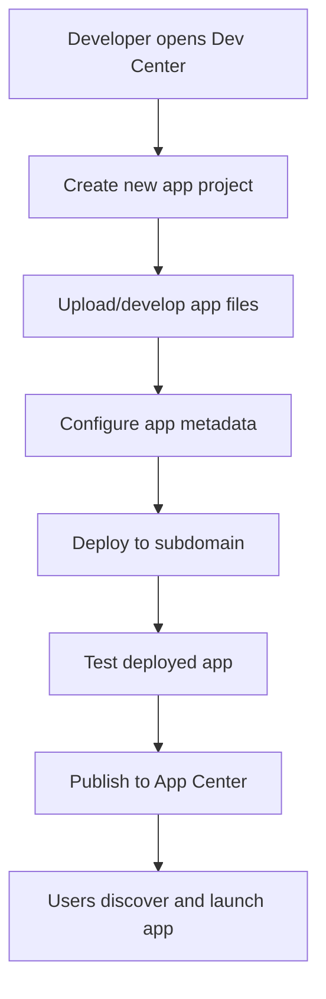
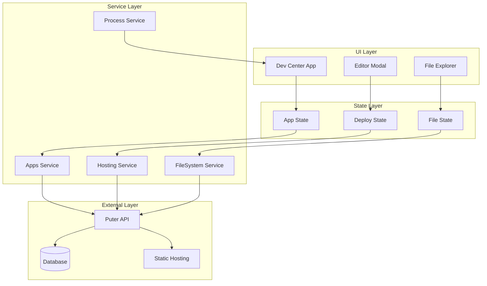
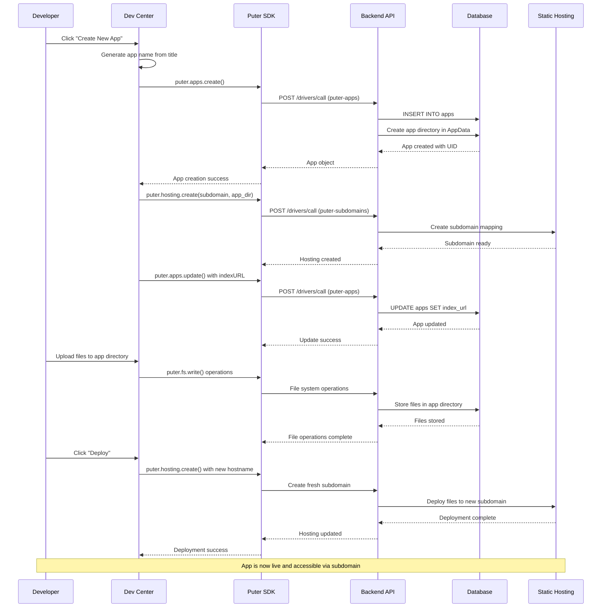

# App Development & Publishing Platform Lifecycle

## Use Case: Cloud-Based Development Platform
**User Story**: As a web developer, I want to create, develop, and publish web applications through Puter's Dev Center so I can build and distribute apps without traditional hosting setup.

## Layer 1: User Journey Flow



## Layer 2: Component Architecture



### Component Mapping Table

| Component | Implementation | File:Line |
|-----------|---------------|-----------|
| Dev Center App | `create_app()` function | `src/dev-center/js/dev-center.js:259` |
| Apps Service | `Apps` class | `src/puter-js/src/modules/Apps.js:3` |
| Hosting Service | `Hosting` class | `src/puter-js/src/modules/Hosting.js:4` |
| FileSystem Service | `PuterJSFileSystemModule` | `src/puter-js/src/modules/FileSystem/index.js:22` |
| Process Service | `ProcessService` class | `src/gui/src/services/ProcessService.js:24` |
| App Entity Storage | `AppES` class | `src/backend/src/om/entitystorage/AppES.js:32` |
| Apps Router | Express router | `src/backend/src/routers/apps.js:31` |
| Hosting Middleware | `PuterSiteMiddleware` | `src/backend/src/routers/hosting/puter-site.js:33` |

## Layer 3: Detailed Sequence Flow



### Key Design Patterns

1. **Repository Pattern**: `AppES` class abstracts database operations for apps
2. **Service Layer Pattern**: SDK modules provide clean API abstractions
3. **Event-Driven Architecture**: IPC system handles app-to-GUI communication

## Data Structures

```typescript
// App creation request
interface AppCreateRequest {
  title: string;           // Display name
  name: string;            // URL-safe identifier
  indexURL?: string;       // Entry point URL
  description?: string;    // App description
  icon?: string;          // Base64 encoded icon
  maximizeOnStart?: boolean;
  background?: boolean;
  filetypeAssociations?: string[];
  metadata?: Record<string, any>;
  dedupeName?: boolean;    // Auto-rename if name exists
}

// App entity in database
interface AppEntity {
  id: number;
  uid: string;            // app-{uuid} format
  owner_user_id: number;
  icon?: string;
  name: string;           // Unique identifier
  title: string;          // Display name
  description?: string;
  godmode: boolean;
  maximize_on_start: boolean;
  index_url: string;      // Entry point
  approved_for_listing: boolean;
  approved_for_opening_items: boolean;
  approved_for_incentive_program: boolean;
  timestamp: Date;
  last_review?: Date;
  tags?: string;
  app_owner?: number;
}

// Hosting configuration
interface HostingConfig {
  subdomain: string;      // Generated subdomain name
  root_dir: string;       // App directory path
  associated_app_id?: string;
}

// Deployment response
interface DeploymentResponse {
  success: boolean;
  subdomain: string;
  indexURL: string;       // Final deployed URL
  hostname: string;       // Generated hostname
}
```

## Quick Reference

### Event Triggers
- **App Creation**: `puter.apps.create()` call from Dev Center
- **File Upload**: Drag & drop or file picker in Dev Center
- **Deployment**: `puter.hosting.create()` with fresh hostname
- **App Launch**: User clicks app in App Center or desktop

### API Formats
- **Apps API**: `/drivers/call` with `puter-apps` interface
- **Hosting API**: `/drivers/call` with `puter-subdomains` interface
- **File System**: Standard Puter FS API operations
- **Authentication**: Bearer token in Authorization header

### Error Handling
- **Name Conflicts**: Auto-rename with `-{number}` suffix
- **Subdomain Conflicts**: Generate random suffix
- **File Upload Errors**: Show specific error messages
- **Deployment Failures**: Rollback to previous version
- **Permission Errors**: Redirect to authentication

## Related Lifecycles

1. **File Management & Sharing** (`002_lifecycle_file_management_sharing.md`)
   - Uses same FileSystem Service and API patterns
   - Shares authentication and permission models

2. **User Authentication & Account Management** (`003_lifecycle_auth_account.md`)
   - Apps require user authentication for creation
   - Shares session management and user context

3. **App Discovery & Launch** (`004_lifecycle_app_discovery_launch.md`)
   - Published apps become available in App Center
   - Uses Process Service for app launching

4. **Cross-Device File Synchronization** (`005_lifecycle_cross_device_sync.md`)
   - App files sync across devices via FileSystem Service
   - Shares same storage and sync mechanisms

5. **Self-Hosting & Customization** (`006_lifecycle_self_hosting.md`)
   - Self-hosted instances use same app creation patterns
   - Shares deployment and hosting infrastructure

## Component Overview

### Key Components and Services

| Component | Role | Key Methods |
|-----------|------|-------------|
| **Dev Center** | UI for app development and management | `create_app()`, `deploy_app()` |
| **Apps SDK** | Client-side app management API | `create()`, `update()`, `list()`, `delete()` |
| **Hosting SDK** | Static hosting and subdomain management | `create()`, `update()`, `list()` |
| **FileSystem SDK** | File operations for app development | `write()`, `read()`, `mkdir()`, `stat()` |
| **AppES** | Database abstraction for apps | `select()`, `upsert()`, name validation |
| **ProcessService** | App lifecycle management in GUI | `register()`, `launchApp()`, `unregister()` |
| **PuterSiteMiddleware** | Subdomain routing and static hosting | `run()`, subdomain resolution |
| **ExecService** | App launching and IPC management | `launchApp()`, process communication |

This lifecycle demonstrates how Puter provides a complete development platform from creation to deployment, with clean separation of concerns across UI, services, and infrastructure layers.
